# Prompt Manager (프롬프트 관리 프로그램)

자주 쓰는 AI 프롬프트를 저장·조회·검색·즐겨찾기할 수 있는 **Python 콘솔 프로그램**입니다.
터미널에서 메뉴 번호를 입력해 기능을 선택하는 방식으로 동작합니다.

이전 미션 「PRD 초안 작성 자동화 — LLM 업무 자동화 과제」에서 실제로 사용한 프롬프트 6개가
기본 데이터로 등록되어 있습니다.

---

## 실행 방법

**요구 사항**: Python 3.10 이상 (개발·테스트 환경: Python 3.14.6)
외부 라이브러리는 사용하지 않습니다. 표준 문법만으로 동작합니다.

```bash
python prompt_manager.py
```

VSCode에서는 `prompt_manager.py`를 연 뒤 우측 상단 ▶ 실행 버튼을 눌러도 됩니다.

실행하면 아래 메뉴가 출력되고, 번호를 입력해 기능을 선택합니다.

```
========================================
        📌 프롬프트 관리 프로그램
========================================
 1. 프롬프트 추가
 2. 프롬프트 목록 보기
 3. 카테고리별 조회
 4. 프롬프트 검색
 5. 프롬프트 상세 보기
 6. 즐겨찾기 추가/해제
 7. 즐겨찾기 목록 보기
----------------------------------------
 8. JSON 파일로 저장
 9. JSON 파일에서 불러오기
10. 카테고리별 Markdown 내보내기
----------------------------------------
 0. 종료
========================================
번호를 선택하세요:
```

---

## 기능 목록

| 번호 | 기능 | 설명 |
|:---:|------|------|
| 1 | 프롬프트 추가 | 제목·내용·카테고리를 입력받아 등록합니다. 제목이나 내용이 비면 다시 입력을 요청하고, 카테고리는 목록에서 번호로 고르거나 직접 입력할 수 있습니다. 즐겨찾기 기본값은 `False`입니다. |
| 2 | 프롬프트 목록 보기 | 저장된 모든 프롬프트를 번호·제목·카테고리·즐겨찾기(⭐)와 함께 출력합니다. |
| 3 | 카테고리별 조회 | 카테고리를 선택하면 해당 카테고리의 프롬프트만 보여줍니다. 없으면 안내 메시지를 출력합니다. |
| 4 | 프롬프트 검색 | 키워드를 입력받아 **제목 또는 내용**에 포함된 프롬프트를 찾습니다. 결과가 없으면 안내 메시지를 출력합니다. |
| 5 | 프롬프트 상세 보기 | 번호를 입력하면 제목·카테고리·즐겨찾기 여부와 **내용 전문**을 출력합니다. |
| 6 | 즐겨찾기 추가/해제 | 번호를 입력해 즐겨찾기 상태를 켜고 끕니다. |
| 7 | 즐겨찾기 목록 보기 | 즐겨찾기한 프롬프트만 모아서 보여줍니다. |
| 8 | JSON 파일로 저장 | 현재 프롬프트 전체를 `prompts.json`에 저장합니다. *(보너스)* |
| 9 | JSON 파일에서 불러오기 | `prompts.json`을 읽어 현재 목록을 교체합니다. 파일이 없거나 형식이 깨졌으면 안내 메시지를 출력하고 **기존 데이터를 그대로 유지**합니다. *(보너스)* |
| 10 | 카테고리별 Markdown 내보내기 | 카테고리마다 `exports/카테고리명.md` 파일을 만들어 프롬프트를 정리해 내보냅니다. *(보너스)* |
| 0 | 종료 | 프로그램을 종료합니다. |

- 잘못된 번호를 입력하면 안내 메시지를 출력하고 메뉴를 다시 보여줍니다.
- 각 기능을 수행한 뒤에는 항상 메뉴로 돌아옵니다.
- **모든 화면에서 프롬프트 번호는 전체 목록 기준으로 표시됩니다.** 검색이나 카테고리 조회
  결과에 뜬 번호를 그대로 상세 보기·즐겨찾기에 사용할 수 있습니다.

### 중복 제목 처리 규칙

**제목은 목록 안에서 고유해야 합니다.** 프롬프트를 추가할 때 이미 있는 제목을 입력하면
등록을 막고 **사용자에게 어떻게 할지 물어봅니다.** 임의로 거부하거나 조용히 덮어쓰지 않습니다.

| 판정 | 규칙 |
|------|------|
| 중복 판정 기준 | 앞뒤 공백을 제거한 뒤 **문자열이 정확히 일치**하면 중복으로 봅니다. 대소문자가 다르면(`PRD` / `prd`) 다른 제목으로 취급합니다. |
| 검사 시점 | **제목을 입력받은 직후**. 내용·카테고리를 입력하기 전에 검사해 사용자가 헛수고하지 않게 합니다. |
| 검사 대상 | 현재 메모리에 있는 전체 프롬프트 (기본 6개 + 실행 중 추가분) |

중복이 발견되면 몇 번 항목과 겹치는지 알려주고 세 가지 중에서 고르게 합니다.

```
  ⚠ 'PRD 초안 요청 유저 프롬프트'은(는) 이미 2번에 등록된 제목입니다.
    1. 다른 제목으로 다시 입력
    2. 번호를 붙여 등록 (PRD 초안 요청 유저 프롬프트 (2))
    3. 추가 취소
  선택:
```

| 선택 | 동작 |
|:---:|------|
| 1 | 제목을 다시 입력받습니다. **새로 입력한 제목이 또 중복이면 다시 묻습니다.** |
| 2 | 제목 뒤에 `(2)`를 붙여 등록합니다. `(2)`도 이미 있으면 `(3)`, `(4)`… 로 비어 있는 번호를 찾습니다. |
| 3 | 추가를 취소하고 메뉴로 돌아갑니다. 목록은 그대로입니다. |
| 그 외 | `1~3 중에서 선택해주세요` 안내 후 다시 묻습니다. |

**왜 자동으로 처리하지 않았나** — 조용히 덮어쓰면 기존 프롬프트가 예고 없이 사라지고,
무조건 거부하면 "같은 제목의 다른 버전"(예: v1/v2 프롬프트)을 등록할 방법이 없어집니다.
셋 중에 고르게 하면 **사용자가 의도를 밝히므로 데이터가 소리 없이 손실되지 않습니다.**

> 관련 함수: `find_duplicate_index()`(중복 위치 찾기),
> `make_unique_title()`(비어 있는 번호 찾기), `resolve_duplicate_title()`(선택 처리)

---

## 실행 화면

> 아래 화면 중 일부는 보너스 기능(8~10번)을 추가하기 전에 촬영한 것이라
> 메뉴에 8~10번이 보이지 않습니다.

### 메인 메뉴

프로그램을 실행하면 메뉴가 출력되고, 번호를 입력해 기능을 선택합니다.
기능을 수행한 뒤에는 항상 이 메뉴로 돌아옵니다.

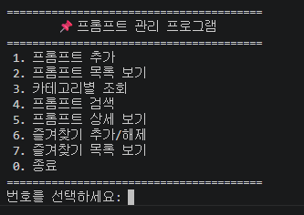

### 프롬프트 추가

제목과 내용을 비운 채 엔터를 누르면 **다시 입력을 요청**합니다.
카테고리는 목록에서 번호로 고르거나 직접 입력할 수 있고, 범위를 벗어난 번호(`9`)를 넣으면
안내 후 다시 물어봅니다. 아래 화면에서는 목록에 없는 `마케팅`을 직접 입력해 등록했습니다.

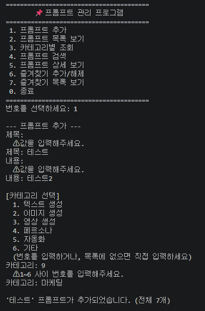

### 프롬프트 목록 보기

전체 프롬프트를 번호·제목·카테고리와 함께 출력하고,
즐겨찾기한 항목(1번·5번)에는 ⭐를 표시합니다.

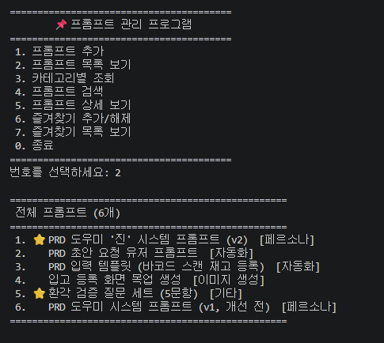

### 프롬프트 검색

제목 또는 내용에 키워드가 포함된 프롬프트를 찾습니다.
`PRD`로 검색하면 5건이 나오는데, **번호가 1·2·3·5·6으로 4번을 건너뜁니다.**
필터된 결과에서도 전체 목록 기준 번호를 그대로 유지하기 때문이며,
덕분에 검색 결과에 뜬 번호를 바로 상세 보기에 사용할 수 있습니다.

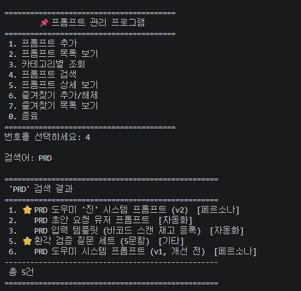

### 카테고리별 조회

카테고리를 선택하면 해당 카테고리의 프롬프트만 보여줍니다.
등록된 프롬프트가 없는 카테고리(`텍스트 생성`)를 고르면 안내 메시지를 출력합니다.

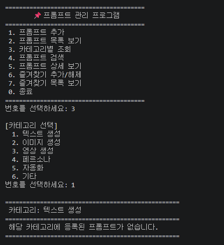

### 프롬프트 상세 보기

번호를 입력하면 제목·카테고리·즐겨찾기 여부와 함께 **내용 전문**을 출력합니다.
목록에는 제목만 나오므로, 긴 프롬프트(1번은 548자)는 이 화면에서 확인합니다.

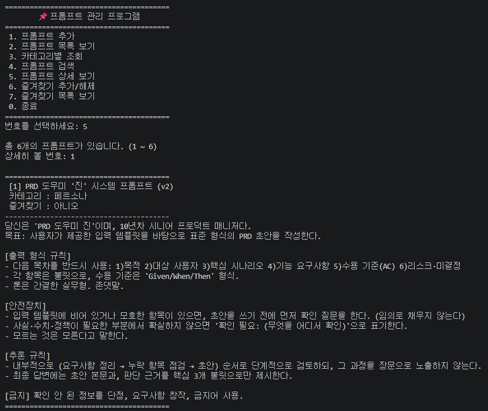
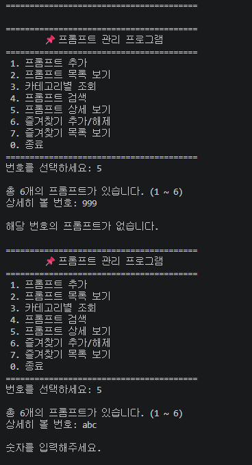

### 즐겨찾기 추가/해제

번호를 입력해 즐겨찾기 상태를 켜고 끕니다.
번호를 고르기 쉽도록 전체 목록을 먼저 보여줍니다.

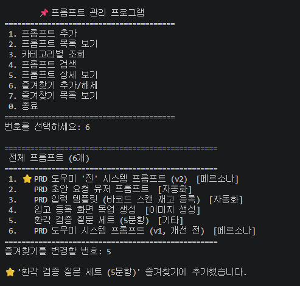

### 잘못된 입력 처리

메뉴에 숫자가 아닌 값(`abc`)이나 빈 값을 입력하면
안내 메시지를 출력하고 메뉴를 다시 보여줍니다.

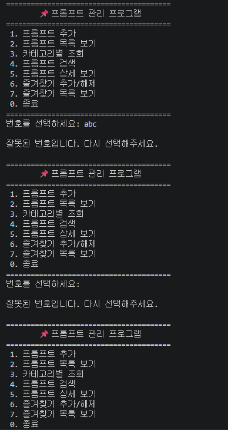

---

## 데이터 저장 방식

프롬프트는 **리스트 안에 딕셔너리**로 저장됩니다.

```python
prompts = [
    {"title": "제목", "content": "내용", "category": "카테고리", "favorite": False},
]
```

| 필드 | 설명 |
|------|------|
| `title` | 프롬프트 제목 |
| `content` | 프롬프트 원문 |
| `category` | 카테고리 |
| `favorite` | 즐겨찾기 여부 (`True` / `False`) |

프로그램 실행 중에 추가한 프롬프트와 즐겨찾기 상태는 계속 유지되지만,
**종료하면 초기 상태(기본 프롬프트 6개)로 돌아갑니다.**

### 파일로 남기려면 (보너스 기능)

자동 저장은 하지 않습니다. 사용자가 직접 메뉴를 선택했을 때만 파일을 읽고 씁니다.

| 파일 | 생성 시점 | 내용 |
|------|-----------|------|
| `prompts.json` | 메뉴 `8` 실행 시 | 전체 프롬프트 (한글 그대로 저장, 들여쓰기 2칸) |
| `exports/*.md` | 메뉴 `10` 실행 시 | 카테고리별 Markdown 파일 |

작업하던 내용을 다음 실행에서 이어가려면 종료 전에 `8`로 저장하고, 다시 실행한 뒤 `9`로 불러오면 됩니다.

```
1. 프롬프트 추가 → 8. 저장 → 0. 종료
   (재실행) → 9. 불러오기 → 이전 상태 복원
```

---

## 프롬프트 카테고리

| 카테고리 | 설명 |
|----------|------|
| 텍스트 생성 | 글·문서·카피 등 텍스트 결과물을 만드는 프롬프트 |
| 이미지 생성 | 이미지 생성 AI에 넣는 프롬프트 (구도·톤·스타일 묘사) |
| 영상 생성 | 영상 생성 AI에 넣는 프롬프트 (모션·카메라·길이 지정) |
| 페르소나 | AI에게 역할·말투·규칙을 부여하는 시스템 프롬프트 |
| 자동화 | 반복 업무를 정형화한 입력 템플릿·요청 프롬프트 |
| 기타 | 위 분류에 속하지 않는 프롬프트 |

카테고리는 위 6개 중에서 고르거나, 목록에 없는 이름을 직접 입력할 수도 있습니다.
직접 입력한 카테고리도 카테고리별 조회 목록에 함께 표시됩니다.

### 기본 등록된 프롬프트

| # | 제목 | 카테고리 |
|:-:|------|----------|
| 1 | PRD 도우미 '진' 시스템 프롬프트 (v2) | 페르소나 |
| 2 | PRD 초안 요청 유저 프롬프트 | 자동화 |
| 3 | PRD 입력 템플릿 (바코드 스캔 재고 등록) | 자동화 |
| 4 | 입고 등록 화면 목업 생성 | 이미지 생성 |
| 5 | 환각 검증 질문 세트 (5문항) | 기타 |
| 6 | PRD 도우미 시스템 프롬프트 (v1, 개선 전) | 페르소나 |

---

## 코드 구조

기능별로 함수를 분리했습니다. 데이터는 전역 변수를 쓰지 않고 `prompts` 리스트를
인자로 전달합니다. (리스트는 가변 객체라 함수 안에서 수정하면 원본에 반영됩니다)

| 함수 | 역할 |
|------|------|
| `get_default_prompts()` | 기본 프롬프트 6개를 반환 |
| `show_menu()` | 메뉴 출력 |
| `add_prompt()` | 프롬프트 추가 |
| `show_list()` | 전체 목록 출력 |
| `show_by_category()` | 카테고리별 조회 |
| `search_prompt()` | 키워드 검색 |
| `show_detail()` | 상세 보기 |
| `toggle_favorite()` | 즐겨찾기 추가/해제 |
| `show_favorites()` | 즐겨찾기 목록 |
| `input_required()` | 빈 입력이면 재요청하는 공통 입력 함수 |
| `choose_category()` | 카테고리 번호 선택 또는 직접 입력 |
| `find_duplicate_index()` | 같은 제목이 이미 있는지 찾아 번호를 반환 |
| `make_unique_title()` | 제목 뒤에 `(2)`, `(3)`… 을 붙여 고유한 제목 생성 |
| `resolve_duplicate_title()` | 중복 제목 발견 시 사용자에게 처리 방법을 묻고 확정 |
| `get_categories()` | 정의된 카테고리 + 사용자 입력 카테고리 합집합 |
| `input_number()` | 번호 입력·검증 공통 처리 |
| `print_prompt_line()` | 목록 한 줄 출력 (목록·검색·카테고리·즐겨찾기 공용) |
| `save_to_json()` | JSON 파일로 저장 *(보너스)* |
| `load_from_json()` | JSON 파일에서 불러오기 *(보너스)* |
| `export_markdown()` | 카테고리별 Markdown 내보내기 *(보너스)* |
| `safe_filename()` | 파일명에 쓸 수 없는 문자를 `_`로 치환 *(보너스)* |
| `main()` | 메인 루프 |

사용한 표준 라이브러리는 `json`(직렬화), `os`(파일·폴더 확인), `sys`(출력 인코딩 고정)뿐이며,
외부 라이브러리는 설치하지 않습니다.

> 파일 상단의 `sys.stdout.reconfigure(encoding="utf-8")`는 즐겨찾기 표시(`⭐`)가
> cp949 환경 터미널에서 `UnicodeEncodeError`를 내며 중단되는 것을 막기 위한 설정입니다.

---

## 설계 결정 (왜 이렇게 만들었는가)

### 1. 왜 리스트 안에 딕셔너리인가

프롬프트 하나는 제목·내용·카테고리·즐겨찾기 **네 개의 값이 한 덩어리로 묶인 것**입니다.
이걸 표현할 방법은 여러 가지가 있었습니다.

| 방식 | 문제 |
|------|------|
| 병렬 리스트<br>`titles=[] contents=[] categories=[]` | 인덱스가 한 번 어긋나면 제목과 내용이 뒤섞입니다. 삭제할 때 세 리스트를 **모두 같은 위치에서** 지워야 하고, 하나라도 빠뜨리면 데이터가 깨집니다. |
| 튜플 리스트<br>`[("제목", "내용", "페르소나", False)]` | 튜플은 **불변**이라 즐겨찾기를 켜고 끌 수 없습니다. 튜플 전체를 새로 만들어 교체해야 합니다. 또 `p[3]`처럼 숫자로 접근해야 해서 3번이 뭐였는지 코드만 봐서는 모릅니다. |
| 클래스 정의 | 가장 견고하지만 기초 문법 범위를 넘고, JSON으로 저장할 때 딕셔너리로 바꾸는 변환 코드가 따로 필요합니다. |
| **리스트 + 딕셔너리** ✅ | 아래 이유로 채택 |

채택한 이유는 네 가지입니다.

1. **필드를 이름으로 읽습니다.** `p["favorite"]`는 주석 없이도 뜻이 분명합니다.
2. **딕셔너리가 가변이라 수정이 한 줄입니다.** 즐겨찾기 토글이
   `p["favorite"] = not p["favorite"]` 로 끝납니다. 튜플이었다면 항목을 통째로 새로 만들어야 합니다.
3. **리스트는 순서를 유지합니다.** 그래서 화면에 보이는 "번호"가 `인덱스 + 1`에 그대로 대응하고,
   번호로 프롬프트를 찾는 코드가 `prompts[number - 1]` 한 줄이 됩니다.
4. **JSON과 구조가 같습니다.** 이게 실제로 이득이 됐습니다 — 보너스로 JSON 저장 기능을 붙일 때
   `json.dump(prompts, ...)` 한 줄로 끝났습니다. 변환 코드를 한 줄도 쓰지 않았습니다.
   나중에 조회수 같은 필드를 추가해도 기존 코드를 고칠 필요가 없습니다.

### 2. 왜 전역 변수를 쓰지 않고 `prompts`를 인자로 넘기는가

`prompts`를 전역 변수로 두면 모든 함수가 어디서든 고칠 수 있어서,
데이터가 언제 어디서 바뀌었는지 추적이 어려워집니다.
인자로 넘기면 **함수 선언만 봐도 그 함수가 프롬프트를 건드리는지 아닌지** 드러납니다.

그러면서도 `return`이 필요 없습니다. 리스트는 가변 객체라
함수 안에서 `append`하면 호출한 쪽의 리스트에 그대로 반영되기 때문입니다.

```python
def add_prompt(prompts):
    prompts.append({...})   # 호출한 쪽 리스트에 그대로 반영됨
```

같은 이유로 `load_from_json()`에서는 `prompts = loaded`가 아니라
`prompts.clear()` + `prompts.extend(loaded)`를 씁니다.
`prompts = loaded`는 **함수 안의 이름표만 바꿀 뿐** 원본 리스트는 그대로여서,
불러오기가 겉보기에만 성공하고 실제로는 아무것도 안 바뀝니다.

### 3. 왜 필터 화면에서도 전체 목록 기준 번호를 쓰는가

검색이나 카테고리 조회 결과에 번호를 `1, 2, 3...`으로 새로 매기면,
사용자가 그 번호로 상세 보기를 눌렀을 때 **엉뚱한 프롬프트가 열립니다.**

그래서 필터된 화면에서도 원래 인덱스를 그대로 표시합니다.
`PRD`로 검색하면 결과 번호가 **1·2·3·5·6으로 4번을 건너뛰는데**, 이게 의도된 동작입니다.
덕분에 검색 결과에서 본 번호를 그대로 상세 보기·즐겨찾기에 쓸 수 있습니다.

```python
for i, p in enumerate(prompts, 1):      # 전체를 순회하되
    if keyword in p["title"]:            # 조건에 맞는 것만 출력
        print_prompt_line(i, p)          # 번호 i는 전체 기준 그대로
```

### 4. 왜 카테고리 목록을 상수와 데이터의 합집합으로 만드는가

| 방식 | 문제 |
|------|------|
| 상수 6개만 사용 | 사용자가 직접 입력한 카테고리(`마케팅` 등)를 조회할 방법이 없습니다. |
| 데이터에서만 추출 | 프롬프트가 0개인 카테고리는 목록에 뜨지 않습니다. 그러면 "해당 카테고리에 등록된 프롬프트가 없습니다"라는 안내를 **띄울 방법 자체가 없어집니다.** |
| **합집합** ✅ | 둘 다 해결됩니다. |

### 5. 왜 공통 함수를 따로 뽑았는가

- `print_prompt_line()` — 목록·검색·카테고리 조회·즐겨찾기 목록 **네 곳이 같은 형식**으로 한 줄을 출력합니다. 한 곳에 모아두면 출력 형식을 바꿀 때 한 군데만 고치면 됩니다.
- `input_number()` — 상세 보기와 즐겨찾기가 **완전히 똑같은 번호 입력·검증 8줄**을 갖고 있었습니다. 묶어서 중복을 없앴습니다.
- `input_required()` — 제목과 내용 둘 다 "비면 다시 묻기"가 필요해서 분리했습니다.

반대로 **묶지 않은 것도 있습니다.** 검색·카테고리·즐겨찾기의
"순회 → 조건 필터 → 개수 세기 → 0이면 안내" 구조도 공통이지만,
이걸 묶으려면 조건을 함수로 넘겨야 해서(고차 함수) 기초 문법 범위를 벗어납니다.
**중복 제거보다 읽기 쉬움을 택했습니다.**

### 6. 왜 즐겨찾기 없는 줄에 전각 공백(`　`)을 넣는가

`⭐`는 한글처럼 화면에서 두 칸을 차지합니다.
일반 공백 한 칸으로 자리를 채우면 즐겨찾기 없는 줄만 제목이 한 칸 왼쪽으로 밀립니다.
같은 폭인 전각 공백을 넣으면 제목이 정확히 맞습니다.

### 7. 왜 `sys.stdout.reconfigure(encoding="utf-8")`가 필요한가

PowerShell에서는 `⭐`가 정상 출력되지만,
출력 인코딩이 cp949인 터미널(Git Bash 등)에서는 `UnicodeEncodeError`가 나며
**프로그램이 중단됩니다.** 실제로 테스트 중에 확인한 문제입니다.
어떤 터미널에서 실행될지 알 수 없으므로 출력 인코딩을 UTF-8로 고정했습니다.

### 8. 왜 JSON을 시작할 때 자동으로 불러오지 않는가

과제 필수 요건이 *"실행 중에 추가한 프롬프트가 유지되고, **종료 시 초기화**"* 입니다.
시작할 때 JSON을 자동으로 읽으면 이 동작이 깨지고, 기본 프롬프트 6개도 덮어써집니다.

그래서 저장(`8`)·불러오기(`9`)를 **메뉴로 분리**했습니다.
기본 동작은 요건 그대로 유지하면서, 사용자가 원할 때만 파일을 씁니다.

### 9. 왜 중복 제목을 사용자에게 물어보는가

[중복 제목 처리 규칙](#중복-제목-처리-규칙) 참조.
조용히 덮어쓰면 데이터가 소리 없이 사라지고, 무조건 거부하면
같은 이름의 다른 버전을 등록할 수 없습니다. 선택지를 주면 둘 다 피할 수 있습니다.

### 10. 왜 병합할 때 `--no-ff`를 쓰는가

옵션 없이 병합하면 fast-forward로 처리되어 커밋이 일직선으로 붙고,
**브랜치를 썼다는 기록이 그래프에서 사라집니다.** 아래 [브랜치 작업 기록](#브랜치-작업-기록)에서 설명합니다.

---

## 개발 환경

| 항목 | 버전 |
|------|------|
| Python | 3.14.6 |
| Git | 2.55.0 |
| 편집기 | VSCode (Python 확장, Korean Language Pack) |

### Python 설치 확인

`python --version`으로 버전을 확인하고, `hello.py`에 `print("Hello")`를 작성해 실행했습니다.

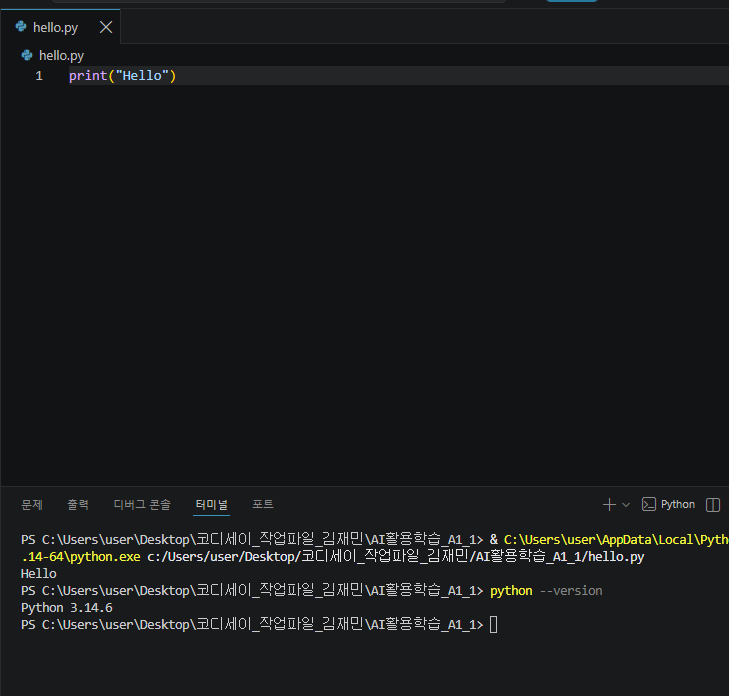

### Git 초기 설정

사용자 이름·이메일과 기본 브랜치(`init.defaultBranch=main`)를 설정하고
`git config --global --list`로 확인했습니다.

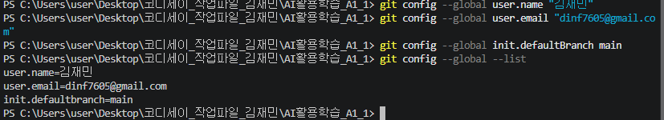

### VSCode ↔ GitHub 연동

VSCode에서 GitHub 계정으로 로그인해 연동을 확인했습니다.

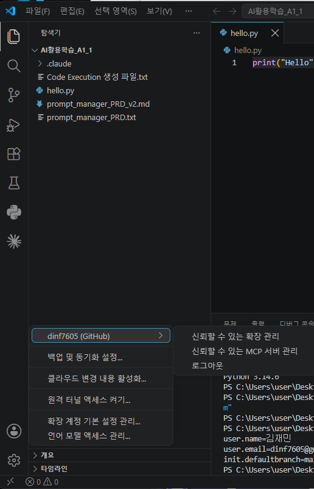

### 공개 저장소 clone 확인

공개 샘플 저장소를 `git clone`으로 내려받아 폴더 구조(`.git` 폴더 포함)와
커밋 로그를 확인했습니다. 확인 후 폴더는 삭제했습니다.

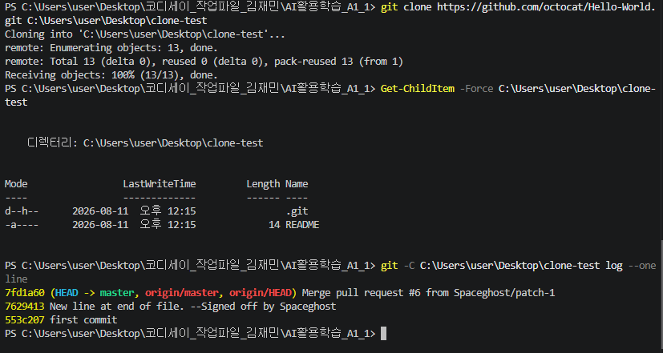

---

## Git 명령어 정리

이 프로젝트를 진행하며 사용한 Git 명령어입니다.

**Git이란?** 파일의 변경 이력을 시점별로 저장해두는 버전 관리 도구입니다.
언제 무엇을 왜 바꿨는지 기록되고, 잘못되면 이전 시점으로 되돌릴 수 있으며,
브랜치로 여러 작업을 분리했다가 다시 합칠 수 있습니다.

| 명령어 | 하는 일 |
|--------|---------|
| `init` | 현재 폴더를 Git 저장소로 만든다 (`.git` 폴더 생성) |
| `add` | 변경된 파일을 커밋 대상(스테이징 영역)에 올린다 |
| `commit` | 스테이징된 변경을 하나의 시점으로 저장소에 기록한다 |
| `push` | 로컬 커밋을 원격 저장소(GitHub)로 올린다 |
| `pull` | 원격 저장소의 변경사항을 로컬로 가져와 합친다 (`fetch` + `merge`) |
| `checkout` | 브랜치를 이동하거나, `-b` 옵션으로 새로 만들며 이동한다 |
| `clone` | 원격 저장소 전체를 이력째 로컬로 복제한다 |
| `merge` | 다른 브랜치의 변경사항을 현재 브랜치로 합친다 |

**스테이징 영역이 왜 있나?** 작업한 것 전부가 아니라 *이번 커밋에 포함할 것만*
골라 담기 위해서입니다. 그래서 "기능 단위 커밋"이 가능해집니다.

### 브랜치 작업 기록

목록 보기 기능(`show_list()`)은 `feature/list` 브랜치에서 작업한 뒤 main에 병합했습니다.

```bash
git checkout -b feature/list      # 브랜치 생성 + 이동
# ... show_list() 구현 및 커밋 ...
git checkout main                 # main으로 복귀
git merge --no-ff feature/list    # 병합 (병합 커밋 생성)
```

`--no-ff` 옵션을 쓴 이유는, 옵션 없이 병합하면 fast-forward로 처리되어
커밋이 일직선으로 붙고 **브랜치를 사용한 기록이 그래프에 남지 않기** 때문입니다.

### 원격 저장소 동기화 (`pull`)

GitHub 웹에서 README를 직접 수정한 뒤 `git pull`로 로컬에 가져왔습니다.
`Fast-forward`와 함께 변경된 파일이 표시됩니다.

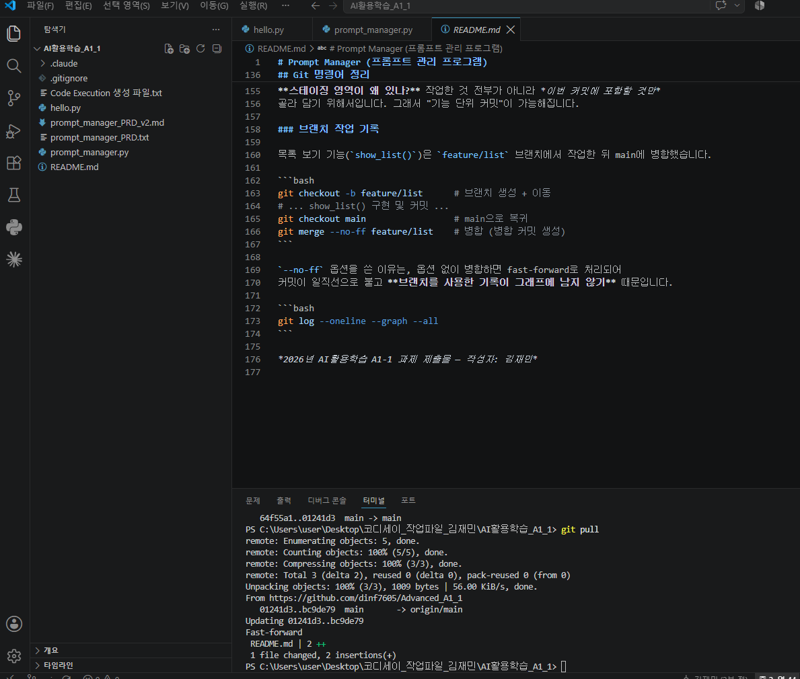

### 커밋 그래프

```bash
git log --oneline --graph --all
```

`feature/list` 브랜치가 갈라졌다가(`|\`) 병합 커밋으로 다시 합쳐지는(`|/`)
모습이 그래프에 남아 있습니다.

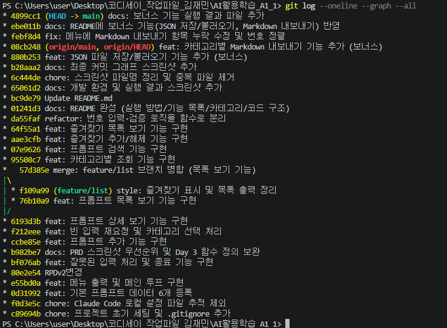

---

## 병합 충돌 대응 절차

### 충돌은 왜 생기는가

Git은 두 브랜치의 변경을 자동으로 합칩니다. 서로 **다른 파일**을 고쳤거나
같은 파일이라도 **떨어진 줄**을 고쳤다면 Git이 알아서 처리합니다.

충돌이 나는 경우는 하나입니다 — **두 브랜치가 같은 파일의 같은 줄을 서로 다르게 고쳤을 때.**
이때 Git은 어느 쪽이 맞는지 판단할 수 없으므로 병합을 멈추고 사람에게 넘깁니다.

이 프로젝트에서 실제로 충돌이 나지 않은 이유는, `feature/list` 브랜치에서 작업하는 동안
main 브랜치에는 아무 커밋도 하지 않았기 때문입니다. 겹치는 변경이 없었습니다.

### 1단계 — 원인 확인

병합을 시도하면 이런 메시지가 나옵니다.

```
Auto-merging prompt_manager.py
CONFLICT (content): Merge conflict in prompt_manager.py
Automatic merge failed; fix conflicts and then commit the result.
```

먼저 **어떤 파일이 충돌했는지** 확인합니다.

```bash
git status
```

`Unmerged paths:` 아래에 나열된 파일이 충돌한 파일입니다.
어떤 내용이 부딪혔는지는 아래로 확인합니다.

```bash
git diff
```

충돌한 파일을 열면 Git이 양쪽 내용을 이렇게 표시해 둡니다.

```
<<<<<<< HEAD
    print(f"{number}. {p['title']}")          ← 현재 브랜치(main)의 내용
=======
    print(f"{number:>2}. {star} {p['title']}")  ← 병합해 오는 브랜치의 내용
>>>>>>> feature/list
```

- `<<<<<<< HEAD` ~ `=======` : **지금 있는 브랜치**의 코드
- `=======` ~ `>>>>>>> 브랜치명` : **가져오려는 브랜치**의 코드

### 2단계 — 해결 (수동 또는 도구)

**수동으로 고칠 때**는 파일을 열어 원하는 최종 형태로 직접 편집하고,
**`<<<<<<<`, `=======`, `>>>>>>>` 세 표시줄을 반드시 지웁니다.**
한쪽만 남길 수도 있고, 두 내용을 섞어 새로 쓸 수도 있습니다.

**VSCode를 쓸 때**는 충돌 부분 위에 버튼이 나타납니다.

| 버튼 | 동작 |
|------|------|
| Accept Current Change | 현재 브랜치(HEAD) 내용만 남김 |
| Accept Incoming Change | 가져오는 브랜치 내용만 남김 |
| Accept Both Changes | 둘 다 남김 (순서 확인 필요) |
| Compare Changes | 양쪽을 나란히 비교 |

버튼을 눌러도 결과가 원하는 코드인지 **눈으로 확인**해야 합니다.
특히 `Accept Both`는 함수가 두 번 정의되는 등의 문제를 만들 수 있습니다.

### 3단계 — 로컬 테스트로 검증

**표시줄만 지웠다고 끝이 아닙니다.** 합친 코드가 실제로 도는지 확인합니다.

```bash
python prompt_manager.py
```

이 프로젝트에서는 최소한 아래를 확인합니다.

1. 프로그램이 오류 없이 실행되고 메뉴가 뜨는가
2. 충돌이 났던 기능이 정상 동작하는가 (예: `2`번 목록에 ⭐가 제대로 표시되는가)
3. 잘못된 입력(`abc`, `99`, 엔터)에 안내 메시지가 나오는가
4. `0`으로 정상 종료되는가

충돌 표시줄이 남아 있으면 Python이 `SyntaxError`를 내므로 실행 즉시 드러납니다.

### 4단계 — 해결 완료 표시 후 커밋

테스트를 통과했으면 해결했다고 알리고 커밋합니다.

```bash
git add prompt_manager.py
```

```bash
git commit
```

`git add`가 "이 파일의 충돌을 해결했다"는 표시입니다.
`git commit`은 병합 커밋 메시지를 자동으로 채워주므로 그대로 저장하면 됩니다.

### 되돌리고 싶을 때

해결이 꼬였다면 병합 전 상태로 되돌릴 수 있습니다.

```bash
git merge --abort
```

작업 내용은 사라지지 않고, 병합을 시도하기 직전 상태로 복구됩니다.

### 충돌을 줄이는 습관

- 브랜치를 오래 두지 말고 **기능 단위로 짧게 쓰고 빨리 병합**합니다.
- 병합 전에 `git pull`로 원격 변경을 먼저 받아옵니다.
- 같은 파일의 같은 부분을 여러 브랜치에서 동시에 고치지 않습니다.

*2026년 AI활용학습 A1-1 과제 제출물 — 작성자: 김재민*
